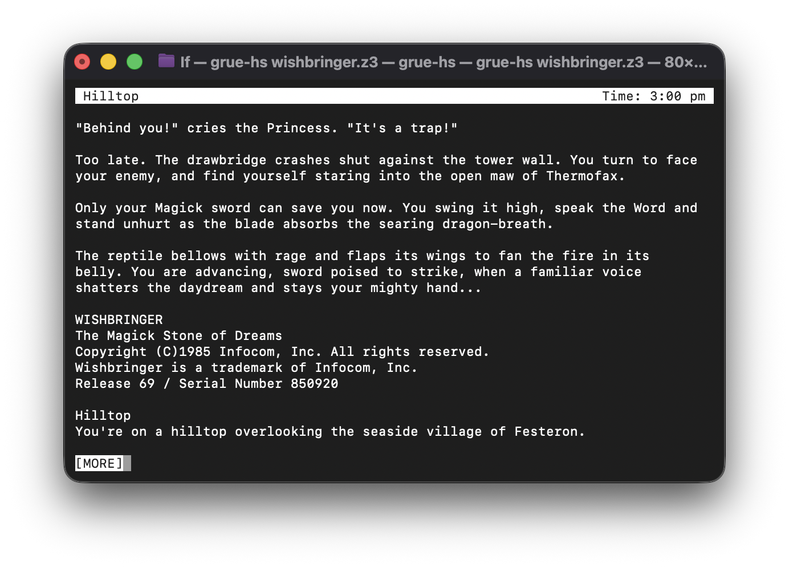

# grue-hs

A Z-machine interpreter written in Haskell. The [Z-machine](https://ifarchive.org/indexes/if-archive/infocom/interpreters/specification/) is the virtual machine that ran Infocom's text adventures, such as [Zork](https://ifdb.org/viewgame?id=0dbnusxunq7fw5ro), [A Mind Forever Voyaging](https://ifdb.org/viewgame?id=4h62dvooeg9ajtfa), and [Wishbringer](https://ifdb.org/viewgame?id=z02joykzh66wfhcl). The interpreter fully supports versions 3 and 4 and has partial support for version 5.

Stories run in the terminal using ncurses. 

<div align="center">
  
</div>

Saving and restoring from files is supported via the [Quetzal format](https://www.inform-fiction.org/zmachine/standards/quetzal/).


## Building

Requires GHC 9.10.x and cabal 3.12 or later.

```
cabal build
cabal install
```

## Running

Once installed, `grue-hs` can be run from the terminal:

```
grue-hs story.z3
```

An optional random seed can be passed in with `--seed N`.

You can also run `grue-hs` from cabal directly (within this folder) like so:

```
cabal run grue-hs -- STORY.z3
```

The `grue-hs` executable opens a full-screen curses interface when run from a terminal. When its input or output is piped, or when run with `--console`, it falls back to plain stdio.

## Testing

The `cabal test` suite runs a set of unit tests along with the (bundled) CZECH conformance suite, and a full save/restore roundtrip against the bundled `cloak.z3`:

```
cabal test
```

To run a single test or group, pass a [tasty](https://hackage.haskell.org/package/tasty) pattern:

```
cabal run grue-test -- -p Quetzal
```

The second check is byte-for-byte transcript comparison against a reference interpreter. `tools/compare.sh` runs both `grue-hs` and `fizmo-console` (an existing, high-quality Z-machine interpreter) over the same walkthrough script and diffs the output. Each walkthrough is written for one story and takes it as the first argument; the bundled `cloak.z3` has one you can run out of the box:

```
tools/compare.sh test/stories/cloak.z3 tools/walkthroughs/cloak.txt
```

The other walkthroughs in `tools/walkthroughs/` (`zork1`, `minizork`, `advent`) target stories that aren't distributed here. You can run them by supplying your own copy of the matching story file.

Walkthroughs stick to deterministic commands, since responses chosen at random (combat, snarky refusals) vary between runs of the reference interpreter itself.

## Acknowledgements

While developing this project, I have relied on [fizmo](https://github.com/chrender/fizmo) for high-quality code to study, as well as a reference interpreter for transcript comparison.

Additionally, ["The Specification of the Z-Machine", by Graham Nelson](https://ifarchive.org/indexes/if-archive/infocom/interpreters/specification/) has been invaluable when implementing the core Z-machine instructions.

## License

BSD-3-Clause. See `LICENSE`.
